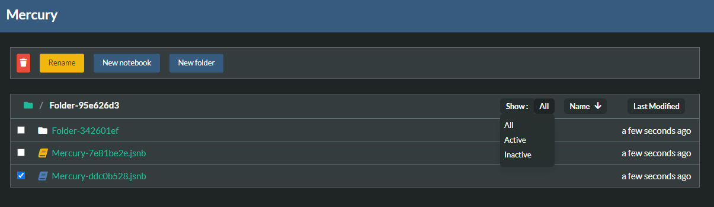
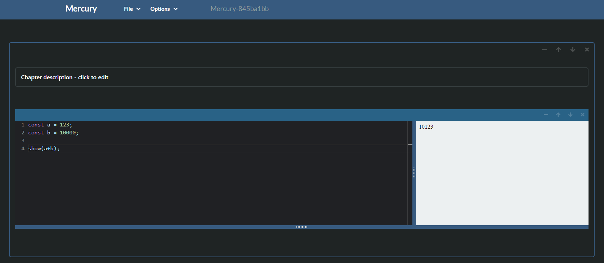
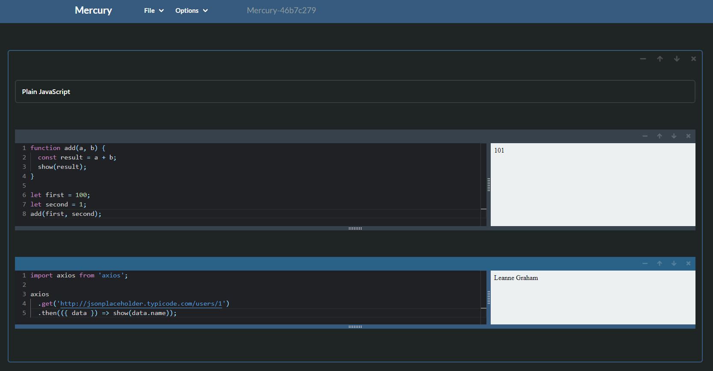
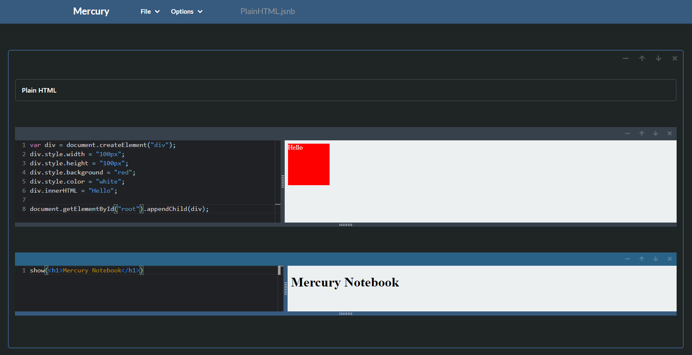
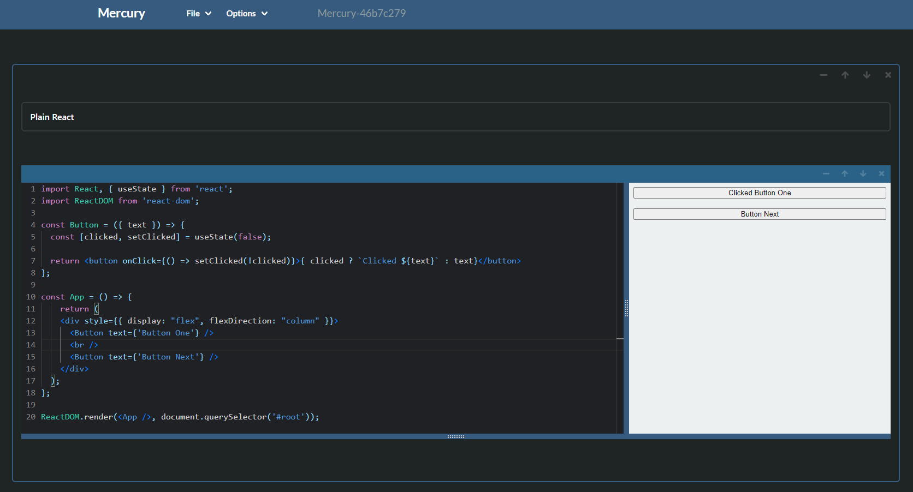

<h1 align="center" style="text-align: center;">Mercury Notebook</h1>

<p align="center">
  <a href="https://www.npmjs.com/package/mercury-notebook">
    
  </a>
</p>

<p align="center">
  <b>A interactive, web-based notebook environment for javascript.</b></br>
  <span>Inspired by the awesome and well-known framework <a href="https://jupyter.org/">Jupyter Notebook</a></span></br>
  <sub>Made with ❤️ by <a href="https://github.com/Luka-stack">Lukasz Rafa (Luka-stack)</a></sub>
</p>

<br />

## ❯ Table of contents

- [Introduction](#-introduction)
- [Installation](#-installation)
- [Mercury Hub](#-mercury-hub)
- [Mercury Sandbox](#-mercury-sandbox)
- [Examples](#-examples)
- [Future Features](#-future-features)
- [Releases](#-releases)
- [Bugs](#-bugs)
- [License](#-license)

## ❯ Introduction

The <b>Mercury Notebook</b> is a interactive, web-based notebook environment for javascript and javascript libraries, frameworks. Its main purpose is to write javascript-related notes, prepare interactive lectures, or for example, quick functionality tests. <b>Mercury Notebook</b> is also equipped in Markdown text editor.

## ❯ Installation

To use <b>Mercury Notebook</b><br>

1. Install npm package globally

```bash
npm i -g mercury-notebook
# or
yarn global add mercury-notebook
```

2. Open terminal in directory where you want to initialize project and run

```bash
mercury-notebook serve [-p port]
```

<i>by default mercury notebook uses port <b>7777</b></i>

<br>

You can run <b>Mercury Notebook</b> with without installing using npx

1. Open terminal in directory where you want to initialize project and then

```bash
npx mercury-notebook serve [-p port]
```

## ❯ Mercury Hub

<b style="font-size: 1.2rem">Hub View</b> is the first page that gets loaded, and from there, you can add a new notebook or folder and manage all of your notebooks and folders.



1. At the top is an action panel with buttons to Add Notebook, Folder. The rename button only shows when there is one and only one file selected, and the delete button (trash icon) shows anytime one or more items are selected.
2. Under the action panel, Breadcrumb is placed that shows where you are.
3. Beneath it, all notebooks and folders that are in your current location are listed. Yellow notebook icon to the left of its name indicate that notebook is active (open in a tab).
4. On the right are three criteria for sorting data.

## ❯ Mercury Sandbox

<b style="font-size: 1.2rem">Sandbox View</b> is where you'll spend most of your time. The sandbox allows you to create a Markdown editor and Code (javascript) editor. This page is divided into sections (you can manage them as you want), and all of them can have multiple code and markdown editors.



## Main

1. its own preview that presents the outcome of your code.
2. function <b><i>show()</i></b> that is used to print stuff on the right canvas<br>

```javascript
show(1 + 2);
// will show 3 on a canvas
```

3. function <b><i>console.log()</b></i> that prints information to the browser console.<br>

```javascript
console.log(1 + 2);
// will show 3 in a browser console
```

## Navbar

In sandbox view, the navbar has three functionalities:

1. <b>Files</b> tab - allows to save and save as a notebook, open an existing notebook or create a new one.
2. <b>Options</b> tab - gives a possibility to disable or enable autosave and auto compile options
3. <b>Name</b> - the notebook's name is displayed in the middle. Clicking it allows changing its name

## Shortcuts

Sandbox view has prepared some shortcuts for quicker work. All of the available shortcuts can be found under <b>Options</b> tab.

## ❯ Examples

All prepared examples are stored in the examples folder.

## Standard Javascript function



## Using HTML tags



## React



## ❯ Future Features

1. Add presentation mode to sandbox
2. Add Sandbox for markdown
3. Add txt and js file handler
4. Separation of context for sections
5. Section inside a section

## [Releases](https://github.com/Luka-stack/mercury-notebook/releases)

## ❯ Bugs

[Issues](https://github.com/Luka-stack/mercury-notebook/issues)

## ❯ License

[MIT](LICENSE)
